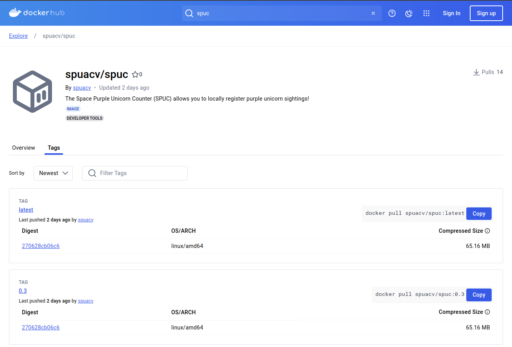

So we want to look at the docs for a container image, but we don't want Docker Desktop anymore!
Where do the docs live?
Actually, they were never part of Docker Desktop, they are part of the Docker Hub!

::::::::::::::::::::::::::::::::::::::: objectives
- Explore the Docker Hub webpage.
- Identify the three components of a container image's identifier.
- Access the readme and other metadata of a container image.
::::::::::::::::::::::::::::::::::::::::::::::::::

:::::::::::::::::::::::::::::::::::::::: questions
- What is the Docker Hub, and why is it useful?
::::::::::::::::::::::::::::::::::::::::::::::::::


## Introducing the Docker Hub

The Docker Hub is an online repository of container images, a vast number of which are publicly available.
A large number of the container images are curated by the developers of the software that they package.
Also, many commonly used pieces of software that have been containerized into images are officially endorsed,
which means that you can trust the container images to have been checked for functionality,
stability, and that they don't contain malware.


:::::::::::::::::::::::::::::::::::::::::  callout
## Docker can be used without connecting to the Docker Hub

Note that while the Docker Hub is well integrated into Docker functionality,
the Docker Hub is certainly not required for all types of use of Docker containers.
For example, some organizations may run container infrastructure that is entirely disconnected from the Internet.
::::::::::::::::::::::::::::::::::::::::::::::::::


## Exploring an example Docker Hub page

The reason we are here is to find the documentation for the SPUC container image.
Lets go ahead and find the image we need for registering our unicorn sightings.

Open your web browser to [https://hub.docker.com](https://hub.docker.com)

{alt='Dockerhub\_landing'}

In the search bar type "spuc" and hit enter.

{alt='Dockerhub\_search'}

You should see a list of images related to spuc and, amongst them, the one we were directed to.
Lets go ahead and select the [spuacv/spuc](https://hub.docker.com/r/spuacv/spuc) container image.

{alt='Dockerhub\_spuc'}

This is a fairly standard docker repository page.
The page is divided into several sections:

The top provides information about the name, endorsements, creator, a short description, tags,
and popularity (i.e. how many downloads it has).

The top-right provides the command to pull this container image to your computer.

The main body of the page contains two tabs, one with the overview, and another with the tags.

The overview tab contains the documentation of the container image.
This is what we wanted!

Since we are here though, lets also look at the tags tab.

The tags tab contains the list of versions of the container image. 
A single repository can have many different versions of container images.
These versions are indicated by "tags".

If we select the "Tags" tab, we can see the list of tags for this container image.

{alt='Dockerhub\_spuc\_tags'}

If we click the version tag for `latest` of this image, Docker Hub shows it as `spuacv/spuc:latest`.

This name structure is the full identifier of the container image and consists of three parts:

```
OWNER/REPOSITORY:TAG
```
The `REPOSITORY` is what we would commonly refer to as the name of the container image.

The `latest` tag is actually the default, and it is used if no tag is specified.

**Note:** The `latest` tag is not always the most recent version of the software.
Tags are actually just labels, and the `latest` tag is just a convention.

You may also have noticed that there are a lot more details about the container image in the page.

{alt='Dockerhub\_spuc_latest'}

In particular, we can see the image layers, which describe in part how the image was created.
This is a very useful feature for understanding what is in the image and evaluating its security.


:::::::::::::::::::::::::::::::::::::::::  spoiler

## Official Images

Some images on Docker Hub are "official images," which means that they are endorsed by the Docker team.

You can see this, for example, with the Python official image.

In the search box, type "python" and hit enter.

You should see a list of images related to python.
We can immediately get a feel of the sheer number of container images hosted here.
There is upwards from 10,000 images related to python alone.

Select the top result, which is the endorsed [python](https://hub.docker.com/_/python) container image.

The "official" badge is shown on the top right of the repository.

{alt='Dockerhub\_python'}

Another thing you may have noticed is that the "owner" of the image is not shown.
This is only true for official images, so instead of `OWNER/CONTAINER_IMAGE_NAME:TAG`,
the name is just `CONTAINER_IMAGE_NAME:TAG`.

::::::::::::::::::::::::::::::::::::::::::::::::::

:::::::::::::::::::::::::::::::::::::::::  spoiler

## Choosing Container Images on Docker Hub

Note that anyone can create an account on Docker Hub and share container images there,
so it's important to exercise caution when choosing a container image on Docker Hub. These
are some indicators that a container image on Docker Hub is consistently maintained,
functional and secure:

- The container image is updated regularly.
- The container image associated with a well established company, community, or other group that is well-known.
  Docker helps with badges to mark official images, verified publishers and sponsored open source software.
- There is a Dockerfile or other listing of what has been installed to the container image.
- The container image page has documentation on how to use the container image.
- The container image is used by the wider community.
  The graph on the right at the search page can help with this.

If a container image is never updated, created by a random person, and does not have a lot
of metadata, it is probably worth skipping over.

::::::::::::::::::::::::::::::::::::::::::::::::::

:::::::::::::::::::::::::::::::::::::::::  spoiler

## Other sources of Container Images

Although many of the containers made for docker are hosted in the Docker Hub, there are other places where these can be distributed, including (but not limited to):

- [GHCR](https://github.com/features/packages) from Github.
- [Quay](https://quay.io/) from Red Hat.
- [Artifact Registry](https://cloud.google.com/artifact-registry) from Google.
- [GLR](https://docs.gitlab.com/ee/user/packages/container_registry/) from GitLab.
- [ECR](https://aws.amazon.com/ecr/) from Amazon.
- [ACR](https://azure.microsoft.com/en-us/products/container-registry) from Azure, Microsoft.

::::::::::::::::::::::::::::::::::::::::::::::::::

So we found our documentation, lets have a careful read through.

:::::::::::::::::::::::::::::::::::::::: keypoints
- The Docker Hub is an online repository of container images.
- The repositories include the container image documentation.
- Container images may have multiple versions, indicated by tags.
- The naming convention for Docker container images is: `OWNER/CONTAINER_IMAGE_NAME:TAG`
::::::::::::::::::::::::::::::::::::::::::::::::::
